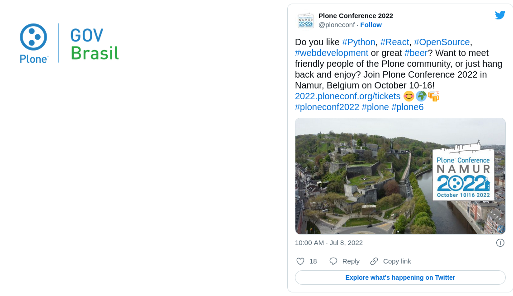
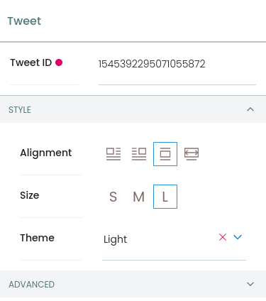

# Twitter Blocks for Volto (@plonegovbr/volto-twitter-block)

Addon implementing Twitter blocks to [Plone](https://plone.org) projects with [Volto](https://github.com/plone/volto).

[](https://www.npmjs.com/package/@plonegovbr/volto-twitter-block)
[](https://plonegovbr.github.io/volto-twitter-block/)
[](https://github.com/plonegovbr/volto-twitter-block/actions/workflows/code.yml)
[](https://github.com/plonegovbr/volto-twitter-block/actions/workflows/unit.yml)

## Screenshots

### Tweet Block Variations


### Tweet Block Alignment



### Tweet Block Editing



## Examples

@plonegovbr/volto-twitter-block can be seen in action at the following sites:

- [Plone Brasil](https://plone.org.br)

You can also check its [Storybook](https://plonegovbr.github.io/volto-twitter-block/).

## Install

### New Volto Project

Create a Volto project

```shell
npm install -g yo @plone/generator-volto
yo @plone/volto my-volto-project --addon @plonegovbr/volto-twitter-block
cd my-volto-project
```

Install new add-on and restart Volto:

```shell
yarn install
yarn start
```

### Existing Volto Project

If you already have a Volto project, just update `package.json`:

```JSON
"addons": [
    "@plonegovbr/volto-twitter-block"
],

"dependencies": {
    "@plonegovbr/volto-twitter-block": "*"
}
```

### Integration with [@kitconcept/volto-blocks-grid](https://github.com/kitconcept/volto-blocks-grid)

If you already have a Volto project, just update `package.json` and make sure `@kitconcept/volto-blocks-grid` is listed before `@plonegovbr/volto-twitter-block` in **addons**:

```JSON
"addons": [
    "@kitconcept/volto-blocks-grid",
    "@plonegovbr/volto-twitter-block"
],

"dependencies": {
    "@kitconcept/volto-blocks-grid": "*",
    "@plonegovbr/volto-twitter-block": "*"
}
```

### Test it

Go to http://localhost:3000/

## Credits

The development of this add on was sponsored by the Brazilian Plone Community

[](https://plone.org.br/)
